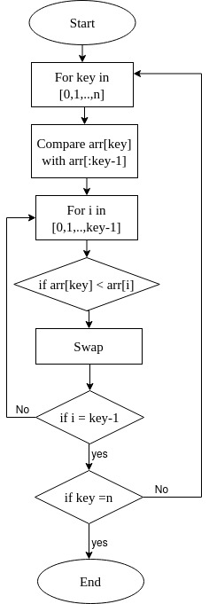
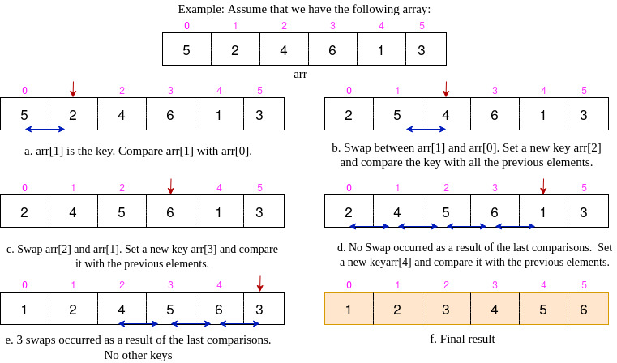
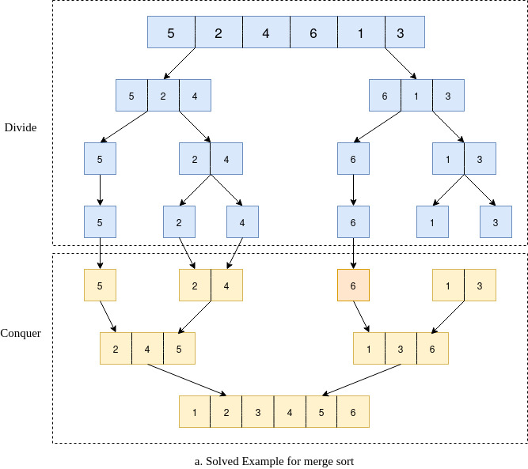

# Insertion Sort
### Algorithm Description  
Insertion sort is a sorting algorithm that places an unsorted element at its suitable place in each iteration.

### Example  

### Complixity

O(N^2)

# Merge Sort
### Algorithm Description  
Merge sort works on the principle of Divide and Conquer. Merge sort repeatedly breaks down a list into several sublists until each sublist consists of a single element and merging those sublists in a manner that results into a sorted list.
### Example  

### Complixity

T(n) = 2T(n/2) + O(N) + O(1)

O(nlogn)

