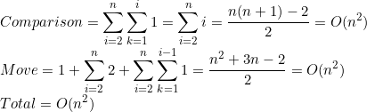

# Insertion Sort
### Algorithm Description  
Insertion sort is a sorting algorithm that places an unsorted element at its suitable place in each iteration.

### Complixity
#### Best Case

#### Worst Case

### Example  

# Merge Sort
### Algorithm Description  
Merge sort works on the principle of Divide and Conquer. Merge sort repeatedly breaks down a list into several sublists until each sublist consists of a single element and merging those sublists in a manner that results into a sorted list.
### Complixity

 Let's write that in a mathematical way: 

### Example  

