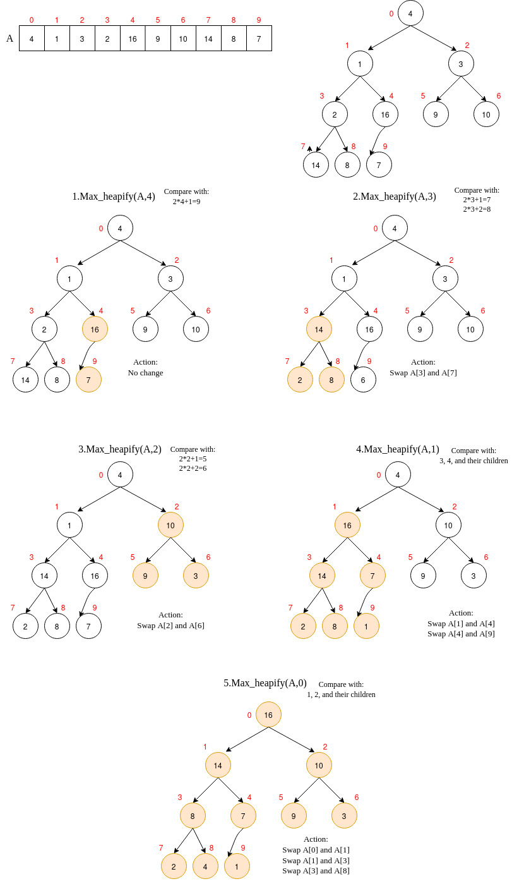

# Heap Sorting

### Heap as a Tree

- Root = i (Starting from i =0)
- Parents = (i/2)+1
- Left child, Right child = 2i+1, 2i+2

### Algorithm Steps

1. Build max heap from unsorted array and max-heapify it.
2. Find Maximum element A[0].
3. Swap A[n] and A[0], now maximum elment is at the end of the array.
4. Discard node n from heap(by decrementing heap size variable).
5. Max-heapify new heap after swaping.
6. Go to step 2 unless heap is empty.

### Example
## Maxheapify the Unsorted Array

## Solve the Sorting Problem

